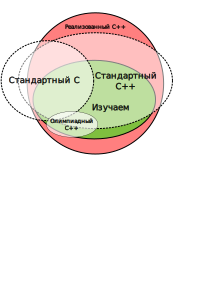

# Что изучаем

    * Есть реализованный в компиляторах C++.
      Компиляторов много разных.
    * Есть стандартный C++.
    * Есть стандартный Си. Это другой язык, который возник раньше и послужил основой. Но с тех пор разошлись.
    * Есть олимпиадный C++. Он маленький.
    * А изучать мы будем что-то другое
* Сравните объёмы:
    * https://en.cppreference.com/w/cpp/language против https://en.cppreference.com/w/c/language
      (это только язык, без библиотеки)
    https://en.cppreference.com/w/cpp против https://en.cppreference.com/w/c (с библиотеками)
* Есть протекающие абстракции: https://www.joelonsoftware.com/2002/11/11/the-law-of-leaky-abstractions/
    * C++ старый, но хочет совместимость с Си
    * Могут возникнуть беды со строчками: `"foo" + "bar"` и `"foo" + 4` делает чушь
    * Может возникнуть "препроцессор", "арифметика указателей", но мы это попробуем
      отложить до второго семестра

Все проблемы идут из концепции "программист всегда прав, даже если он неправ".
А из противоречия математически выводится абсолютно что угодно, любое поведение.

# Стандарты языка
У C++ есть несколько версий с разными фичами: C++98, C++03, C++11 (C++0x по историческим причинам),
C++14 (C++1y), C++17 (C++1z), C++20, C++23 (многое не поддерживается), сейчас в работе 26.
Почти обратно совместимы.

Мы используем C++17/20, но я буду делать отсылки к старым и новым.
На работе может встретиться любая версия в зависимости от.
Потому что мигрировать между версиями и компиляторами конкретно в C++ очень сложно: https://www.youtube.com/watch?v=kJSXhZzEyZU

# Зоопарк компиляторов
https://notes.algoprog.ru/cpp/basic_info.html#id5

Компилятор - программа, которая преобразует _исходный код_ в _исполняемый файл_ (бинарник, экзешник).
Для этого ей обычно нужна _стандартная библиотека C++_ и что-то ещё.
Обычно компилятор и стандартная библиотека тесно связаны (у каждого своя реализация), но не всегда.

Упомянуть GCC (GNU Compiler Collection), Clang (LLVM, форк от Apple), Visual Studio, Intel C++ Compiler.
Есть отдельно компилятор и отдельно стандартная библиотека (обычно они тесно связаны, но бывают варианты).

Стандарт: попытка договориться, иногда получается: https://en.cppreference.com/w/cpp/compiler_support
Документ формальный. Из интересного: as-if rule.
По факту компиляторов зоопарк, а ещё сам стандарт позволяет очень вольные трактовки.
Их даже описывать необязательно.

Бывают расширения компиляторов вроде: https://gcc.gnu.org/onlinedocs/gcc/C_002b_002b-Extensions.html
Их иногда утаскивают друг у друга (Clang у GCC для совместимости), иногда чуть меняется синтаксис.
А иногда общее: `#pragma pack` (не было на лекции).
На самом деле это всё может быть спецификой не только компилятора, но и стандартной библиотеки,
вроде `<bits/stdc++.h>`.

## Комбинации компиляторов
Есть онлайн-компиляторы (wandbox, godbolt, cppinsights, ideone), но их вам не хватит.

В домашках должно работать под почти всеми комбинациями:

* Ubuntu
    * gcc + GNU libstdc++ (стандартная комбинация)
    * LLVM clang + GNU libstdc++
    * LLVM clang + LLVM libc++
    * Intel C++ Compiler Classic + GNU libstdc++
* Windows
    * Visual C++ + Microsoft STL (стандартная комбинация)
    * 32-битные и 64-битные версии (под разные виды процессоров: старые и новые)
    * Много сборок gcc/libstdc++ с названиями mingw и mingw64: https://www.mingw-w64.org/downloads/
    * Много сборок LLVM clang
* macOS
    * Apple Clang + Apple libc++ (похожи на LLVM, но не совсем)
    * Есть сборки gcc и LLVM clang

Лучшей нет. Выбираете ту, что "принято" использовать вокруг вас.

Они обычно одинаковые, но чуть-чуть отличаются. И компилятор про это не расскажет:

* https://t.me/experimentalchill/96
* Portability is Reliability: http://evan.nemerson.com/2021/05/04/portability-is-reliability/

Как жить: выбираете один компилятор, под ним работает (где удобнее), регулярно проверяете код на
других компиляторах и ОС.
В домашках это будет автоматические, но медленно, редко и с плохой обратной связью, лучше локально.

# Среды разработки
Удобно иметь подсветку синтаксиса, подсказки "что писать дальше", мгновенную перемотку к функции,
запуск компилятора, предупреждения о возможных ошибках и так далее.
Этим занимаются IDE: бывают специализированные (CLion, Visual Studio), бывают накручены поверх редакторов.
Вопрос вкуса и удобства: https://notes.algoprog.ru/cpp/ide.html

Проект - это набор настроек "как компилировать".

Я умею: либо текстовый редактор и компилировать из консоли, либо Visual Studio, либо CLion.
Люблю текстовый редактор.
Практики могут иметь другие предпочтения.

# Системы сборки
Так как IDE на вкус и цвет, а компилировать сложно, обычно делают через "систему сборки".
Чтобы можно было одним конкретным консольным приложением, которое везде есть, компилировать.
А дальше IDE могут проект системы сборки превратить в свой.

Системы сборки в C++ обычно прибиты гвоздями к компилятору: проект Visual Studio, файл `Makefile`,
система Ninja...

Поэтому придумали ещё слой: CMake, проект - это файл `CMakeLists.txt`, а CMake умеет сгенерировать
проект под любую систему сборки.  А CLion читает `CMakeLists.txt` напрямую.

Поэтому можно считать, что `CMakeLists.txt` - это такой "проект на C++", если мы живём в хоть
сколько-то хорошем мире (но нет).
